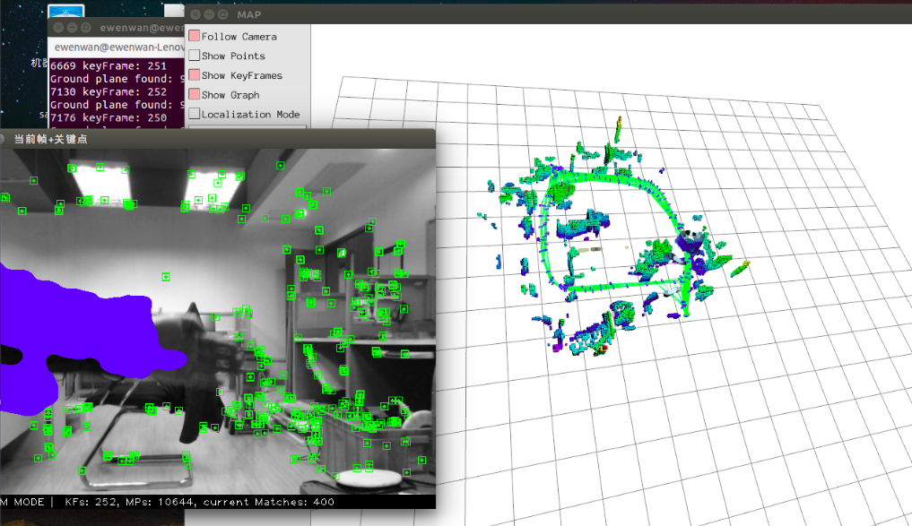

# 修改 
    添加一个点云建图线程，接收来自 Tracking线程的关键帧。
    使用 彩色图和深度图 生成点云
    对关键帧 的 彩色图 使用 mobilenetv2-ssd-lite 进行目标检测。
    对每个目标区域 的点云计算 点云中心 3D包围框信息 ( 会使用深度均值进行滤波)。
    加入到 语义目标数据库中。
    当 是相同的类别且位置中心没有太大的变化，则认为是同一个物体，融合相关信息。
# 参考
[mobilenetv2-ssd-lite 目标检测](https://github.com/Ewenwan/MVision/tree/master/CNN/HighPerformanceComputing/example)

[图漾相机](https://github.com/Ewenwan/MVision/tree/master/stereo/RGBD/orb_slam2_rgbd)

[oRB_SLAM2](https://github.com/Ewenwan/MVision/tree/master/vSLAM/oRB_SLAM2)

> 动态环境处理

[]() 
[dynslam 光流运动  语义分割](http://www.cvlibs.net/publications/Barsan2018ICRA.pdf) 
[DynaSLAM 多视角几何 语义分割](https://arxiv.org/pdf/1806.05620.pdf) 
[光流运动一致性检测，投影点距离基线距离阈值 语义分割 DS-SLAM ](https://arxiv.org/ftp/arxiv/papers/1809/1809.08379.pdf) 
[相机运动 与 像素点运动比较 阈值](http://sci-hub.tw/https://linkinghub.elsevier.com/retrieve/pii/S0167865518308523) 

> 语义信息融合

[Towards Semantic SLAM using a Monocular Camera ](http://webdiis.unizar.es/~jcivera/papers/civera_etal_iros11.pdf) 
[Probabilistic Data Association for Semantic SLAM](https://www.cis.upenn.edu/~kostas/mypub.dir/bowman17icra.pdf) 
[VSO: Visual Semantic Odometry](https://demuc.de/papers/lianos2018vso.pdf) 
[]() 


# 改进点
    1. 考虑动态环境(语义信息、多视角几何、光流、运动一致性检测)
    2. 动态更新 语义地图 (语义信息 加入到 数据关联 损失函数中、octo-map语义地图概率更新语义和动态特性)
    3. orbslam2地图 与 octomap地图的 保存与载入

# 改进
    将 语义数据库信息 加入到 octo-map 中
    使用  octo-map的概率信息 更新语义数据库

# 最终效果图

> octomap地图：


> ORB-SLAM2地图切换


> 语义pcl点云图


# 遗留问题
    
    目标检出率低(更好的目标检测/实例分割模型、地图点和语义信息化挂钩，将语义信息加入到数据关联目标函数中)
    octomap的动态地图更新效果不太理想(octomap 概率更新探索，建图时直接剔除动态点)
    地图大了之后，系统 响应变慢 (地图维护)
    
    地图导航、路径规划
    智能导航
     

#  数据关联

    路标点集合        L = {Lm} m=[1:M]   
    传感器姿态序列    X = {xt} t=[1:T]
    传感器测量值      Z = {zk} k=[1:K]

    数据关联        D = {(ak, bk)} k=[1:K]
                  意义是 地zk次测量下 姿态 x_ak 和 路标点 L_bk 相关联
                  
    统计学方法,已知数据 Z，求出现Z的最大概率对应的系统参数 L,X,D========        
    普通硬决策方法：(特征点法====)
                  先求得一个准确的 关联D'    D' <---arg max  log  p(D|X0,L0,Z)
                  
                  使用先验的 位姿X0(orb-slam2中运动模型得到) 和 
                  已经存在的地图点L0 以及传感器观测信息Z
                  求解一个最大概率的 2D-3D点数据关联 / 3D-3D点数据关联
                   
                  取对数，仍然是正相关，[0，1] ---->映射到 [-无穷大,0]
                  在使用这个关联D  来最大化 模型(X,L,D)出现数据Z的概率，
                  得到最优 的 X，L
                  X，L <------ arg max p(Z|X,L,D')
                  
                  通过最小化 数据关联误差(即最大化观测成立概率)，优化位姿X 和 地图点L
                  
    软决策，考虑不确定性：(类似直接法，不需要准确的数据关联)
                  关联D 是由多种状态 叠加而成，是一个叠加状态，薛定鄂的猫===^===^===
                  首先考虑所有 可能的 数据关联 D 
                         计算其数据分布 获得每一种关联zk (Xak, Lbk) 对应的概率 wij
                         位姿Xak下，测量值 zk 关联 地图点 Lbk
                  在多种数据关联下 最大化
                          X，L <------ arg max sum(sum( wij * log p(zk|ak, bk)))

    地图点属于每种类类别的概率分布
    
    
#  语义误差计入到目标函数
    
    常规 损失函数: 光度误差(photometric error, 直接法，光度不变，数据关联点，灰度误差)
                  几何误差(geometric error,   特征点法，重投影位置误差)
    语义误差：
                  语义分割观测 Sk
                  地图点 P 3d坐标、属于每种类别的概率(Wic),主要用于误差加权
                  p(Sk| 相机位姿Tk, 地图点位置Xi, 对应2d投影点类别)
                  
                  
                  一个语义分割Sk ----> n 个 不同类别的 0-1 mask
                                      属于 当前类的为1，其它类为0
                  
                  2D像素点 -----> 1D 具体类别 距离函数
     
# ORB-SLAM2
**Authors:** [Raul Mur-Artal](http://webdiis.unizar.es/~raulmur/), [Juan D. Tardos](http://webdiis.unizar.es/~jdtardos/), [J. M. M. Montiel](http://webdiis.unizar.es/~josemari/) and [Dorian Galvez-Lopez](http://doriangalvez.com/) ([DBoW2](https://github.com/dorian3d/DBoW2))

**13 Jan 2017**: OpenCV 3 and Eigen 3.3 are now supported.

**22 Dec 2016**: Added AR demo (see section 7).

ORB-SLAM2 is a real-time SLAM library for **Monocular**, **Stereo** and **RGB-D** cameras that computes the camera trajectory and a sparse 3D reconstruction (in the stereo and RGB-D case with true scale). It is able to detect loops and relocalize the camera in real time. We provide examples to run the SLAM system in the [KITTI dataset](http://www.cvlibs.net/datasets/kitti/eval_odometry.php) as stereo or monocular, in the [TUM dataset](http://vision.in.tum.de/data/datasets/rgbd-dataset) as RGB-D or monocular, and in the [EuRoC dataset](http://projects.asl.ethz.ch/datasets/doku.php?id=kmavvisualinertialdatasets) as stereo or monocular. We also provide a ROS node to process live monocular, stereo or RGB-D streams. **The library can be compiled without ROS**. ORB-SLAM2 provides a GUI to change between a *SLAM Mode* and *Localization Mode*, see section 9 of this document.

<a href="https://www.youtube.com/embed/ufvPS5wJAx0" target="_blank"></a>
<a href="https://www.youtube.com/embed/T-9PYCKhDLM" target="_blank"></a>
<a href="https://www.youtube.com/embed/kPwy8yA4CKM" target="_blank"></a>


### Related Publications:

[Monocular] Raúl Mur-Artal, J. M. M. Montiel and Juan D. Tardós. **ORB-SLAM: A Versatile and Accurate Monocular SLAM System**. *IEEE Transactions on Robotics,* vol. 31, no. 5, pp. 1147-1163, 2015. (**2015 IEEE Transactions on Robotics Best Paper Award**). **[PDF](http://webdiis.unizar.es/~raulmur/MurMontielTardosTRO15.pdf)**.

[Stereo and RGB-D] Raúl Mur-Artal and Juan D. Tardós. **ORB-SLAM2: an Open-Source SLAM System for Monocular, Stereo and RGB-D Cameras**. *IEEE Transactions on Robotics,* vol. 33, no. 5, pp. 1255-1262, 2017. **[PDF](https://128.84.21.199/pdf/1610.06475.pdf)**.

[DBoW2 Place Recognizer] Dorian Gálvez-López and Juan D. Tardós. **Bags of Binary Words for Fast Place Recognition in Image Sequences**. *IEEE Transactions on Robotics,* vol. 28, no. 5, pp.  1188-1197, 2012. **[PDF](http://doriangalvez.com/php/dl.php?dlp=GalvezTRO12.pdf)**

# 1. License

ORB-SLAM2 is released under a [GPLv3 license](https://github.com/raulmur/ORB_SLAM2/blob/master/License-gpl.txt). For a list of all code/library dependencies (and associated licenses), please see [Dependencies.md](https://github.com/raulmur/ORB_SLAM2/blob/master/Dependencies.md).

For a closed-source version of ORB-SLAM2 for commercial purposes, please contact the authors: orbslam (at) unizar (dot) es.

If you use ORB-SLAM2 (Monocular) in an academic work, please cite:

    @article{murTRO2015,
      title={{ORB-SLAM}: a Versatile and Accurate Monocular {SLAM} System},
      author={Mur-Artal, Ra\'ul, Montiel, J. M. M. and Tard\'os, Juan D.},
      journal={IEEE Transactions on Robotics},
      volume={31},
      number={5},
      pages={1147--1163},
      doi = {10.1109/TRO.2015.2463671},
      year={2015}
     }

if you use ORB-SLAM2 (Stereo or RGB-D) in an academic work, please cite:

    @article{murORB2,
      title={{ORB-SLAM2}: an Open-Source {SLAM} System for Monocular, Stereo and {RGB-D} Cameras},
      author={Mur-Artal, Ra\'ul and Tard\'os, Juan D.},
      journal={IEEE Transactions on Robotics},
      volume={33},
      number={5},
      pages={1255--1262},
      doi = {10.1109/TRO.2017.2705103},
      year={2017}
     }

# 2. Prerequisites
We have tested the library in **Ubuntu 12.04**, **14.04** and **16.04**, but it should be easy to compile in other platforms. A powerful computer (e.g. i7) will ensure real-time performance and provide more stable and accurate results.

## C++11 or C++0x Compiler
We use the new thread and chrono functionalities of C++11.

## Pangolin
We use [Pangolin](https://github.com/stevenlovegrove/Pangolin) for visualization and user interface. Dowload and install instructions can be found at: https://github.com/stevenlovegrove/Pangolin.

## OpenCV
We use [OpenCV](http://opencv.org) to manipulate images and features. Dowload and install instructions can be found at: http://opencv.org. **Required at leat 2.4.3. Tested with OpenCV 2.4.11 and OpenCV 3.2**.

## Eigen3
Required by g2o (see below). Download and install instructions can be found at: http://eigen.tuxfamily.org. **Required at least 3.1.0**.

## DBoW2 and g2o (Included in Thirdparty folder)
We use modified versions of the [DBoW2](https://github.com/dorian3d/DBoW2) library to perform place recognition and [g2o](https://github.com/RainerKuemmerle/g2o) library to perform non-linear optimizations. Both modified libraries (which are BSD) are included in the *Thirdparty* folder.

## ROS (optional)
We provide some examples to process the live input of a monocular, stereo or RGB-D camera using [ROS](ros.org). Building these examples is optional. In case you want to use ROS, a version Hydro or newer is needed.

# 3. Building ORB-SLAM2 library and examples

Clone the repository:
```
git clone https://github.com/raulmur/ORB_SLAM2.git ORB_SLAM2
```

We provide a script `build.sh` to build the *Thirdparty* libraries and *ORB-SLAM2*. Please make sure you have installed all required dependencies (see section 2). Execute:
```
cd ORB_SLAM2
chmod +x build.sh
./build.sh
```

This will create **libORB_SLAM2.so**  at *lib* folder and the executables **mono_tum**, **mono_kitti**, **rgbd_tum**, **stereo_kitti**, **mono_euroc** and **stereo_euroc** in *Examples* folder.

# 4. Monocular Examples

## TUM Dataset

1. Download a sequence from http://vision.in.tum.de/data/datasets/rgbd-dataset/download and uncompress it.

2. Execute the following command. Change `TUMX.yaml` to TUM1.yaml,TUM2.yaml or TUM3.yaml for freiburg1, freiburg2 and freiburg3 sequences respectively. Change `PATH_TO_SEQUENCE_FOLDER`to the uncompressed sequence folder.
```
./Examples/Monocular/mono_tum Vocabulary/ORBvoc.txt Examples/Monocular/TUMX.yaml PATH_TO_SEQUENCE_FOLDER
```

## KITTI Dataset  

1. Download the dataset (grayscale images) from http://www.cvlibs.net/datasets/kitti/eval_odometry.php 

2. Execute the following command. Change `KITTIX.yaml`by KITTI00-02.yaml, KITTI03.yaml or KITTI04-12.yaml for sequence 0 to 2, 3, and 4 to 12 respectively. Change `PATH_TO_DATASET_FOLDER` to the uncompressed dataset folder. Change `SEQUENCE_NUMBER` to 00, 01, 02,.., 11. 
```
./Examples/Monocular/mono_kitti Vocabulary/ORBvoc.txt Examples/Monocular/KITTIX.yaml PATH_TO_DATASET_FOLDER/dataset/sequences/SEQUENCE_NUMBER
```

## EuRoC Dataset

1. Download a sequence (ASL format) from http://projects.asl.ethz.ch/datasets/doku.php?id=kmavvisualinertialdatasets

2. Execute the following first command for V1 and V2 sequences, or the second command for MH sequences. Change PATH_TO_SEQUENCE_FOLDER and SEQUENCE according to the sequence you want to run.
```
./Examples/Monocular/mono_euroc Vocabulary/ORBvoc.txt Examples/Monocular/EuRoC.yaml PATH_TO_SEQUENCE_FOLDER/mav0/cam0/data Examples/Monocular/EuRoC_TimeStamps/SEQUENCE.txt 
```

```
./Examples/Monocular/mono_euroc Vocabulary/ORBvoc.txt Examples/Monocular/EuRoC.yaml PATH_TO_SEQUENCE/cam0/data Examples/Monocular/EuRoC_TimeStamps/SEQUENCE.txt 
```

# 5. Stereo Examples

## KITTI Dataset

1. Download the dataset (grayscale images) from http://www.cvlibs.net/datasets/kitti/eval_odometry.php 

2. Execute the following command. Change `KITTIX.yaml`to KITTI00-02.yaml, KITTI03.yaml or KITTI04-12.yaml for sequence 0 to 2, 3, and 4 to 12 respectively. Change `PATH_TO_DATASET_FOLDER` to the uncompressed dataset folder. Change `SEQUENCE_NUMBER` to 00, 01, 02,.., 11. 
```
./Examples/Stereo/stereo_kitti Vocabulary/ORBvoc.txt Examples/Stereo/KITTIX.yaml PATH_TO_DATASET_FOLDER/dataset/sequences/SEQUENCE_NUMBER
```

## EuRoC Dataset

1. Download a sequence (ASL format) from http://projects.asl.ethz.ch/datasets/doku.php?id=kmavvisualinertialdatasets

2. Execute the following first command for V1 and V2 sequences, or the second command for MH sequences. Change PATH_TO_SEQUENCE_FOLDER and SEQUENCE according to the sequence you want to run.
```
./Examples/Stereo/stereo_euroc Vocabulary/ORBvoc.txt Examples/Stereo/EuRoC.yaml PATH_TO_SEQUENCE/mav0/cam0/data PATH_TO_SEQUENCE/mav0/cam1/data Examples/Stereo/EuRoC_TimeStamps/SEQUENCE.txt
```
```
./Examples/Stereo/stereo_euroc Vocabulary/ORBvoc.txt Examples/Stereo/EuRoC.yaml PATH_TO_SEQUENCE/cam0/data PATH_TO_SEQUENCE/cam1/data Examples/Stereo/EuRoC_TimeStamps/SEQUENCE.txt
```

# 6. RGB-D Example

## TUM Dataset

1. Download a sequence from http://vision.in.tum.de/data/datasets/rgbd-dataset/download and uncompress it.

2. Associate RGB images and depth images using the python script [associate.py](http://vision.in.tum.de/data/datasets/rgbd-dataset/tools). We already provide associations for some of the sequences in *Examples/RGB-D/associations/*. You can generate your own associations file executing:

  ```
  python associate.py PATH_TO_SEQUENCE/rgb.txt PATH_TO_SEQUENCE/depth.txt > associations.txt
  ```

3. Execute the following command. Change `TUMX.yaml` to TUM1.yaml,TUM2.yaml or TUM3.yaml for freiburg1, freiburg2 and freiburg3 sequences respectively. Change `PATH_TO_SEQUENCE_FOLDER`to the uncompressed sequence folder. Change `ASSOCIATIONS_FILE` to the path to the corresponding associations file.

  ```
  ./Examples/RGB-D/rgbd_tum Vocabulary/ORBvoc.txt Examples/RGB-D/TUMX.yaml PATH_TO_SEQUENCE_FOLDER ASSOCIATIONS_FILE
  ```

# 7. ROS Examples

### Building the nodes for mono, monoAR, stereo and RGB-D
1. Add the path including *Examples/ROS/ORB_SLAM2* to the ROS_PACKAGE_PATH environment variable. Open .bashrc file and add at the end the following line. Replace PATH by the folder where you cloned ORB_SLAM2:

  ```
  export ROS_PACKAGE_PATH=${ROS_PACKAGE_PATH}:PATH/ORB_SLAM2/Examples/ROS
  ```
  
2. Execute `build_ros.sh` script:

  ```
  chmod +x build_ros.sh
  ./build_ros.sh
  ```
  
### Running Monocular Node
For a monocular input from topic `/camera/image_raw` run node ORB_SLAM2/Mono. You will need to provide the vocabulary file and a settings file. See the monocular examples above.

  ```
  rosrun ORB_SLAM2 Mono PATH_TO_VOCABULARY PATH_TO_SETTINGS_FILE
  ```
  
### Running Monocular Augmented Reality Demo
This is a demo of augmented reality where you can use an interface to insert virtual cubes in planar regions of the scene.
The node reads images from topic `/camera/image_raw`.

  ```
  rosrun ORB_SLAM2 MonoAR PATH_TO_VOCABULARY PATH_TO_SETTINGS_FILE
  ```
  
### Running Stereo Node
For a stereo input from topic `/camera/left/image_raw` and `/camera/right/image_raw` run node ORB_SLAM2/Stereo. You will need to provide the vocabulary file and a settings file. If you **provide rectification matrices** (see Examples/Stereo/EuRoC.yaml example), the node will recitify the images online, **otherwise images must be pre-rectified**.

  ```
  rosrun ORB_SLAM2 Stereo PATH_TO_VOCABULARY PATH_TO_SETTINGS_FILE ONLINE_RECTIFICATION
  ```
  
**Example**: Download a rosbag (e.g. V1_01_easy.bag) from the EuRoC dataset (http://projects.asl.ethz.ch/datasets/doku.php?id=kmavvisualinertialdatasets). Open 3 tabs on the terminal and run the following command at each tab:
  ```
  roscore
  ```
  
  ```
  rosrun ORB_SLAM2 Stereo Vocabulary/ORBvoc.txt Examples/Stereo/EuRoC.yaml true
  ```
  
  ```
  rosbag play --pause V1_01_easy.bag /cam0/image_raw:=/camera/left/image_raw /cam1/image_raw:=/camera/right/image_raw
  ```
  
Once ORB-SLAM2 has loaded the vocabulary, press space in the rosbag tab. Enjoy!. Note: a powerful computer is required to run the most exigent sequences of this dataset.

### Running RGB_D Node
For an RGB-D input from topics `/camera/rgb/image_raw` and `/camera/depth_registered/image_raw`, run node ORB_SLAM2/RGBD. You will need to provide the vocabulary file and a settings file. See the RGB-D example above.

  ```
  rosrun ORB_SLAM2 RGBD PATH_TO_VOCABULARY PATH_TO_SETTINGS_FILE
  ```
  
# 8. Processing your own sequences
You will need to create a settings file with the calibration of your camera. See the settings file provided for the TUM and KITTI datasets for monocular, stereo and RGB-D cameras. We use the calibration model of OpenCV. See the examples to learn how to create a program that makes use of the ORB-SLAM2 library and how to pass images to the SLAM system. Stereo input must be synchronized and rectified. RGB-D input must be synchronized and depth registered.

# 9. SLAM and Localization Modes
You can change between the *SLAM* and *Localization mode* using the GUI of the map viewer.

### SLAM Mode
This is the default mode. The system runs in parallal three threads: Tracking, Local Mapping and Loop Closing. The system localizes the camera, builds new map and tries to close loops.

### Localization Mode
This mode can be used when you have a good map of your working area. In this mode the Local Mapping and Loop Closing are deactivated. The system localizes the camera in the map (which is no longer updated), using relocalization if needed. 

